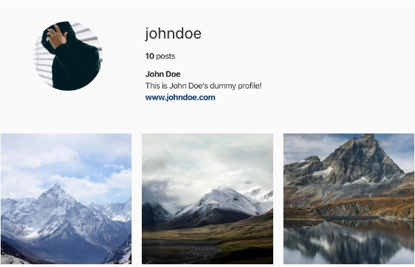

# Indiegram 

A minimalist theme based on Gatsby.js and DatoCMS to plan your feed.

If you want to use try this out yourself, you first need to set up a project on DatoCMS which will host your data.
You can sign up for a free account and then you can simply click this button:
